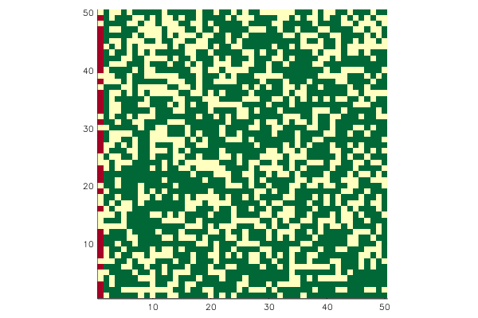
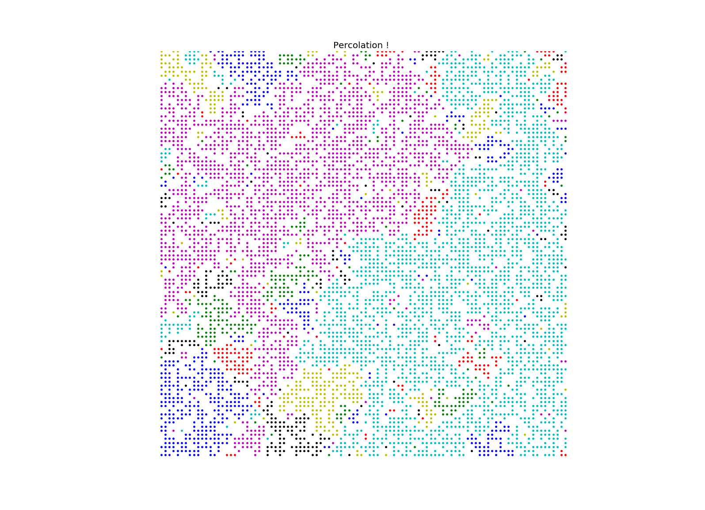

# Percolation

This package is for simulating percolation theory. You can computer cluster size and check if percolating or not.

Support for following lattice site percolation.

- Square lattice
  - nearest neighbor
  - next nearest neighbor
- Triangular lattice
  - nearest neighbor
- d dimensional simple lattice
  - nearest neighbor
- Honeycomb lattice
  - nearest neighbor
- Kagome lattice
  - nearest neighbor

In order to learn how to use this package, see [example/percolation.ipynb](http://nbviewer.jupyter.org/github/goropikari/Percolation.jl/blob/master/example/percolation.ipynb).

